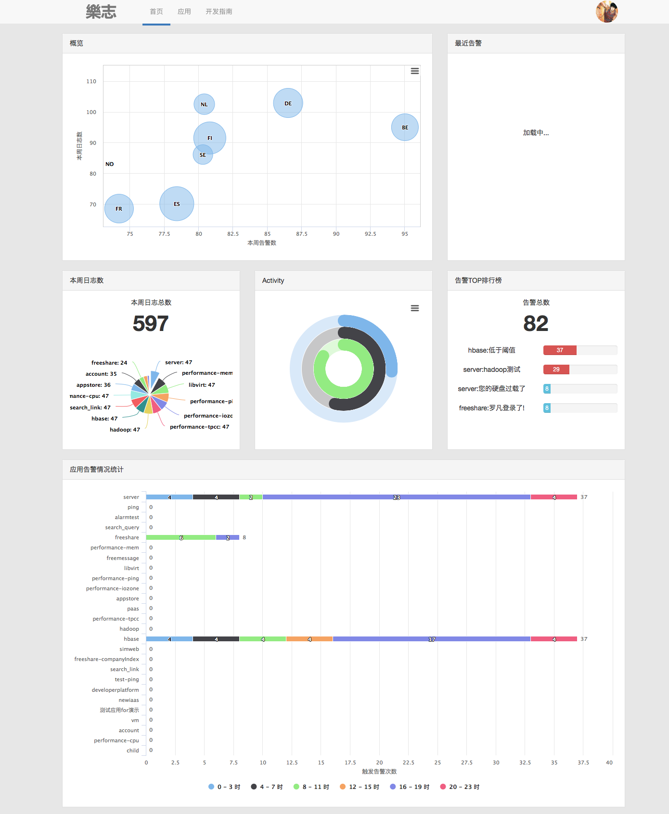

> 在浏览器中，JavaScript是单线程的。某些时候我们可能它具备多线程的功能。阮一峰在博客中提到了 [Javascript异步编程的4种方法](http://www.ruanyifeng.com/blog/2012/12/asynchronous＿javascript.html) 。下面我就其中最基础常见的基于回调的实现方法，说说它在乐志用户门户首页中的应用。

# 应用场景

  乐志用户门户首页长的是下图这个样子。眼花缭乱的图表预示着繁多的数据。而从乐志这个比较“庞大”（相对自邮之翼的各应用而言）的分布式日志存储系统，拉取数据的速度并不快。假如这整个页面的数据我一次性取完，那么用户可能需要在account的登录页等上20多秒，然后才能看到这个酷炫的首页。这不是我们想要的。 
  
  那么从前端的角度来说，比较好的方法就是异步加载各数据，来一份数据显示一个图表。刚开始我确实也是这样实现的。 
  
  但是随着图表数量的增加，比如加入了这个“概览”，其实它需要的数据和“本周日志数”、“应用告警情况统计”都有重合，如果我还要为这个图表再去拉取一次数据，后端再添加一个Action，是多余的，完全可以重用之前的数据。 
  
  那问题来了：之前的数据都是异步加载得到的，我怎么知道它来没来呢？而且像“概览”这种可能同时需要“日志”和“告警”2份数据的，又怎么让它在2份数据到来以后再开始显示呢？ 
  
  也就是说，每个图表都在等待着它需要的数据（其实我刚开始傻乎乎地写了个while死循环来不断检测数据来没来，然后浏览器就卡死了...才反应过来js是单线程）。
  


# 基于回调的异步实现方法
  正如阮一峰在博客中所写，比较基础的方法是使用回调函数。 
  
  例如有2个函数f1和f2，f1比较耗时，f2是需要异步执行的，不确定发生时间，它需要f1中的某段代码触发条件。那把f2作为f1的一个回调函数即可。其实ajax就是典型的基于回调的异步实现。


```javascript
f1(f2); //这样一来f2的发生就不需要在我们的程序中指定，而是取决于f1何时执行到callback处
function f1（callback）{
    ...
    callback();
    ...
}
function f2(){...}
```

# 乐志首页的数据和图表异步加载实现方式

  梳理下乐志首页数据和图表加载的逻辑：

- 数据通过ajax异步加载获得；
- 某个图表只有等它需要的所有数据都到了才开始绘制，也就是数据到达触发图表绘制。

  首先定义各数据（appWeekLogs、alarmHistoryList、topAlarmList），初始化为null（等待ajax请求的数据返回再修改）；然后分别为各数据添加一个触发器trigger，初始化为false，当它对应的数据的ajax请求返回后再设为true，表示“数据已到”。

```javascript
//**** 以下定义了本页面异步加载的数据和其触发器 ****
//xxx_trigger是触发器，用以实现异步效果：使用到了appWeeklogs这个数据的所有图表，只有等appWeekLogs_trigger为true了才能触发
var appWeekLogs_trigger = false;    
//等待异步加载的数据，初始化为null。
var appWeekLogs = null;
var alarmHistoryList_trigger = false;
var alarmHistoryList = null;
var topAlarmList_trigger = false;
var topAlarmList = null;
//**** end：数据和触发器 ****
```

  OK，接下来可以写页面加载数据和图表的逻辑了。 
  
  既然是“基于回调”，让“数据到达”这个事件去触发“绘制图表”这个事件，就是要让“绘制图表”作为回调函数在“数据到达”中去调用。那么我们要做的就是把回调函数放到一个合适的位置。简单情况下，数据和图表是一对一的关系，那么直接把“绘制图表”放到请求数据的ajax回调函数里即可。 
  
  但是现在是多对多的关系，一个数据可能被多个图表使用，一个图表也可能使用多个数据，就需要使用上面定义的触发器去判断每一个图表需要的数据是否都到了，并且每到一个数据就要对所有的图表都判断一遍，看能否开始绘制。 
  
  这部分的核心是showChartsRules()这个函数，它就是我们之前所说的那个`回调函数`。在每一个请求数据的ajax返回后，都要调用这个回调函数。由于上面说的“多对多”的缘故，就需要在showChartsRules()中对各图表的绘制条件进行判断。所以为什么取”showChartsRules”这个名字，就是因为它其实囊括了各图表绘制的规则，先决条件的判断。 
  
  另外还有一点，因为showChartsRules在每个数据返回后都要调用，所以可能会导致一个图表绘制多次，所以要再加一层判断，让绘制过的表格不再绘制。这层判断就是一组xxxChart_displayed的布尔变量标示。
  

```javascript
//****以下标志该图表已绘制过****
// 因为showChartsRules()会重复运行多次，不要反复重绘
var appWeekLogsChart_displayed = false;
var alarmCharts_displayed = false;
var topAlarmsChart_displayed = false;
//**** end：图表已绘标志 ****
//页面加载完毕，开始异步加载数据和图表
$(function () {
    //获取数据
    getAppWeekLogs();
    getAlarmHistories();
    getTopAlarms();
    //其实主逻辑就这3句话，后面的函数都是供这3句话调用的
    //通过ajax请求异步获取appWeekLogs这个数据
    function getAppWeekLogs(){
          $.get(
            '/app/appsWeekLogs',
            {},
            function (data) {   //ajax回调
                appWeekLogs = data.appsWeekStatus;  //返回的数据赋值给appWeekLogs这个嗷嗷待哺的变量，之前是null
                appWeekLogs_trigger = true; //数据已取到，触发器设为true
                showChartsRules();  //回调函数，看此时可以让哪些图表绘制了
            }
        );
    }
    function getAlarmHistories() {
        $.get(
            '/app/alarmsHistories',
            {},
            function (data) {
                alarmHistoryList = data.alarmMap;
                alarmHistoryList_trigger = true;
                showChartsRules();
            }
        );
    }
    function getTopAlarms() {
        $.get(
            '/app/topAlarms',
            {},
            function (data) {
                topAlarmList = data.topAlarmInfoList;
                topAlarmList_trigger = true;
                showChartsRules();
            }
        );
    }
    //回调函数，实际上定义了每个图表是否可被绘制的条件
    function showChartsRules() {
    //根据数据加载的情况（xxx_trigger是否为true）,确定图表是否可以绘出
        if (appWeekLogs_trigger) {  //需要的数据已到达，可以绘制图表了
            if ( ! appWeekLogsChart_displayed){ //没绘制过的图表才绘制，绘制过就跳过了
                showAppWeekLogsChart(); //绘制图表
                appWeekLogsChart_displayed = true; //记录该图表已绘制过
            }
        }
        if (alarmHistoryList_trigger){
            if ( ! alarmCharts_displayed){
                showAlarmCharts();
                alarmCharts_displayed = true;
            }
        }
        //topAlarmChart这个图表需要alarmHistoryList和topAlarmList两个数据
        if (alarmHistoryList_trigger && topAlarmList_trigger){
            if ( ! topAlarmsChart_displayed){
                showTopAlarms();
                topAlarmsChart_displayed = true;
            }
        }
    }
    //接下来这3个函数其实就是图表的实际绘制函数了。他们均在showChartsRules()这个函数里被调用
    function showAlarmCharts() {
        drawAlarmCharts(alarmHistoryList);
    }
    function showAppWeekLogsChart() {
        drawAppWeekLogChart(appWeekLogs);   
    }
    function showTopAlarms() {
        drawTopAlarmsChart(topAlarmliST, alarmHistoryList);         }
});
```

  注意到代码中的showChartsRules函数虽然叫“回调函数”，但实际上并没有作为参数传给任何一个函数。因为“回调”在这里其实就是一种思想嘛，作用域允许的情况下直接调用就行了。

# 其它实现方法

  其它几种实现方法可以参看阮一峰的博客，其异步实现实际上是设置监听器，然后通过定时器周期性去调用监听器去检查被监听的事件是否被触发，如果是就调用要实现异步的函数。但是一般情况下比较简单的异步需求其实通过回调就可以实现，或者需要根据回调这种思路再修改一下（例如本文“多对多”的处理），就可以达到目的了。

